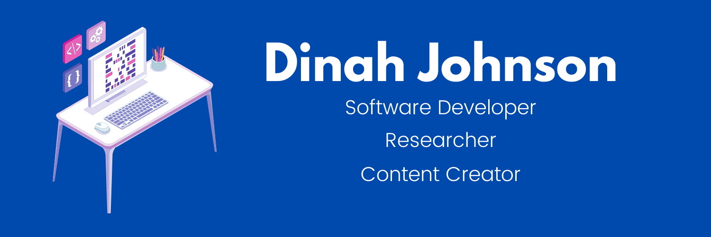

Hi! I'm Dinah, a recent computer science graduate who loves learning and building new things. When I'm not coding I enjoy researching blockchain and spending time on Discord engaging with various tech communities. I also write about computer science topics on my [blog](cybergirldinah.github.io).  

  
:computer: Favorite Tools: Java (server-side), Python (machine-learning), ReactJS (front end), Z Shell, Chrome Dev Tools  
:books: Favorite Books: Frankenstein, Jurassic Park, Crime & Punishment, The Picture of Dorian Gray  
:sparkles: Favorite Hobbies: Reading, Playing Breath of the Wild, Enjoying Nature  
